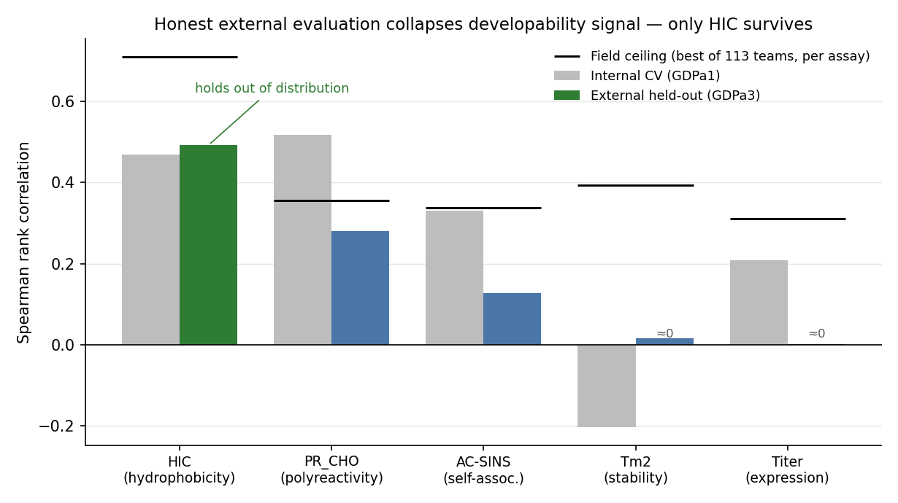

# AntiNETWORK

A leakage-controlled audit of antibody developability assays on the Ginkgo
AbDev benchmark (GDPa1 public training set, 246 antibodies; GDPa3 blinded
held-out set, 80 antibodies). The question it asks is which developability
signals survive honest external evaluation once sequence-family leakage is
controlled — not "can we build a predictor." The headline outcome is mostly
negative, and reporting that accurately is the point of the project.



*Per assay: internal sequence-cluster grouped cross-validation on GDPa1 versus a single prediction on the blinded GDPa3 held-out set. Signal collapses to near zero externally for every assay except HIC (Tm2's internal value is negative — anti-correlated in-fold). Black bars mark the field ceiling — the best per-assay score across the 113 competition teams. Regenerate with `python scripts/plot_headline_collapse.py`.*

## Benchmark

The Ginkgo AbDev competition (GDPa1 training set, GDPa3 held-out set) ran from
8 September to 18 November 2025 with 113 teams. Its results are published, so the
held-out numbers reported here are comparable against a fixed, citable benchmark
— the field ceilings below are the best scores achieved by those teams on the
same held-out set.

- Competition leaderboard: https://huggingface.co/spaces/ginkgo-datapoints/abdev-leaderboard
- Outcomes paper: "2025 Ginkgo Datapoints Antibody Developability Competition
  outcomes: limited model performance and a call for data standardization,"
  *mAbs* (2026), https://doi.org/10.1080/19420862.2026.2634216

## Method

- Crude per-chain and per-CDR physicochemical sequence features: charge,
  hydrophobicity, aromatic content, VH/VL imbalances.
- Models: ridge, elastic-net, random forest, hist-gradient-boosting.
- Sequence-cluster grouped cross-validation as the internal evaluation standard.
- An external GDPa3 firewall: train on GDPa1, predict the blinded held-out set
  once.
- Falsification controls: composition-matched scramble null, label-shuffle null,
  and a sequence-identity kNN baseline.
- Structure-derived charge-topology features and frozen protein-language-model
  (PLM) embeddings are also implemented (see Status).

## Results

Spearman rank correlation per assay. Internal is grouped-CV on GDPa1; external is
the one-time GDPa3 held-out evaluation; the field ceiling is the best of 113
competition teams on the same held-out set.

| Assay   | Internal grouped-CV | External GDPa3 | Field ceiling (best of 113) |
|---------|--------------------:|---------------:|----------------------------:|
| HIC     | ≈ 0.47              | ≈ 0.49 (held)  | 0.708                       |
| PR_CHO  | 0.52                | 0.28           | 0.356                       |
| AC-SINS | 0.33                | 0.13           | 0.337                       |
| Titer   | 0.21                | 0.00           | 0.310                       |
| Tm2     | −0.20               | ≈ 0            | 0.392                       |

HIC is the one assay where the internal number holds out of distribution. On the
same held-out split, a sequence-identity kNN baseline reaches 0.33. So physics
beats nearest-neighbour memorization by roughly 0.16 Spearman externally — the
HIC signal is physicochemical and real, not memorization — but kNN alone reaches
0.33, meaning roughly two-thirds of the achievable HIC rank-order is also
recoverable from sequence similarity. That bound is part of the finding.

## What the audit establishes

Under firewalled evaluation, simple physicochemical features land in the same
range as far heavier methods, because the heavier methods do not generalize
either: the PLM embeddings improve internal cross-validation but reduce external
performance. HIC is the only assay carrying real, leakage-robust,
beyond-memorization signal. Every other assay collapses at the external step.
This independently reproduces, in this pipeline, the conclusion the AbDev
competition organizers published from their own 113-team results — that
cross-validation overstates performance and out-of-distribution generalization
is limited. It is not a new finding; it is independent corroboration arrived at
with falsification controls.

## Status / scope of implementation

Implemented and load-bearing for the result above:

- Physicochemical per-chain/per-CDR features.
- Sequence-cluster grouped cross-validation.
- External GDPa3 firewall.
- Falsification controls: composition-matched scramble null, label-shuffle null,
  sequence-identity kNN baseline.

Implemented but NOT load-bearing:

- Structure-derived charge-topology features and the patchy-particle
  interaction-network simulator are built and unit-tested, but they do not beat a
  composition-matched scramble null. They are not used in the headline result.
- PLM embeddings (ESM-2 35M, Ab-RoBERTa) are implemented but reduce external
  performance, so they are not used in the headline result.

## Firewall hygiene

The GDPa3 held-out labels were used only for one-time external evaluation and a
single audit-time kNN baseline. They informed no model selection, feature
choice, or hyperparameter tuning.

## Data availability

The GDPa1/GDPa3 benchmark data (Ginkgo Datapoints) is gated and carries no stated
redistribution license, so it is **not** included in this repository. Obtain it
from the source under Ginkgo's access terms: GDPa1 is on Hugging Face
(`ginkgo-datapoints/GDPa1`); fetch it with `scripts/download_gdpa.py` after
accepting the dataset terms and running `hf auth login`. GDPa3 is the
gated/external held-out set and is not redistributed here. The only data-derived
files committed are aggregate summary statistics under `results/` — per-assay
metric tables with no per-antibody rows, sequences, or raw assay values.

## Reproduction

```bash
conda env create -f environment.yml
conda activate anti
python scripts/download_gdpa.py        # GDPa1 from Hugging Face, after `hf auth login`
python -m pytest                       # 53 tests, no data or network required
```

### Reproduce the headline numbers

With GDPa1 and GDPa3 obtained from source (GDPa3 is gated/external), each headline
result is regenerated by one entry point; outputs are the aggregate tables under
`results/`.

| Headline | Command | Output |
|----------|---------|--------|
| HIC external ≈ 0.49; PLMs help internal, hurt external | `python scripts/run_v11_descriptor_plm_stack_audit.py` | `results/descriptor_plm_internal_vs_external.csv`, `results/external_vs_field_ceiling.csv` |
| Internal→external collapse (PR_CHO 0.52→0.28, etc.) | `python scripts/run_external_triage_audit.py` | `results/internal_vs_external_triage_comparison.csv` |
| HIC physics 0.49 beats identity-kNN 0.33 | `python scripts/knn_baseline_hic.py` | prints the comparison |
| Topology does not beat a composition-matched null | `antinetwork.topology_falsification.run_topology_falsification_gate` (exercised by `tests/test_topology_falsification.py`) | `results/topology_gate_verdicts.csv` |
