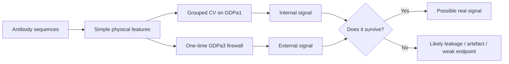

# AntiNETWORK

Pushing simple antibody developability models until they break.

Most antibody developability models look better than they are.

This project asks:

**How far can simple, physically interpretable antibody features go before
external validation kills them?**

The aim is not to build the biggest predictor, stack embeddings, or win a
leaderboard by accident. The aim is to test whether grounded, scientifically meaningful
descriptors: charge, hydrophobicity, aromaticity, VH/VL balance, CDR
composition, framework/subtype effects, and simple topology proxies, carry real
assay signal when sequence-family leakage is controlled.

Some do.

Most do not.

That is the point.

AntiNETWORK is a reproducible audit of antibody developability prediction on the
Ginkgo Datapoints AbDev benchmark: GDPa1 public training data, 246 antibodies;
GDPa3 blinded held-out data, 80 antibodies. The central test is simple: if a
signal looks good in cross-validation but collapses on GDPa3, it was probably
not a robust developability model. It may still be biologically interesting, but
it is not something to trust.




## The result in one picture


Most endpoints look better under internal GDPa1 validation than they do on the
held-out GDPa3 split. HIC is the useful exception: the simple physicochemical
model holds externally. Tm2 also holds numerically, but the audit suggests it is
mostly framework/subtype signal rather than a clean Fab-stability descriptor.

## What survived

The cleanest signal is **HIC**.

Simple physicochemical descriptors reach roughly 0.49 Spearman on the GDPa3
held-out split, close to the internal grouped-CV estimate and above a
sequence-identity kNN baseline. That suggests the HIC signal is not just
sequence-neighbour memorisation. It is partly encoded in basic molecular
properties.

The second apparent signal is **Tm2**, but it is less clean. Raw Tm2 is partly
predictable, but the best simple signal looks more like a framework/subtype
proxy than a direct Fab-stability model. After subtracting the GDPa1-estimated
subtype expectation, the residual Tm2 signal is weak.

So the honest interpretation is:

- HIC: real physicochemical signal.
- Tm2: partly predictable, but mostly through framework/subtype structure in the
  dataset.
- PR_CHO, AC-SINS, Titer: weak or unstable under external validation.
- PLM embeddings: improve some internal scores but do not improve the held-out
  story.
- Topology simulator: built and tested, but does not beat the null, so it is
  not used in the headline result.

## The useful positive result: HIC


On held-out HIC, the simple physicochemical model reaches roughly 0.49 Spearman.
That places it in the same range as stronger published baselines and above the
sequence-only baselines reported in the competition. The interpretation is
narrow: HIC contains real physicochemical signal, but the field ceiling remains
higher, and structure appears to be the missing ingredient.

## What failed

The negative results matter because a simple model is useful when it fails
clearly.

PR_CHO, AC-SINS, and Titer either collapse or remain too weak under the GDPa3
firewall to treat as robust developability predictors. Frozen protein-language
model embeddings improve some internal validation scores, but they do not rescue
the external story. The structure-derived charge-topology features and
patchy-particle interaction-network simulator are implemented and unit-tested,
but they do not beat a composition-matched scramble null.

That is not an embarrassment. It is the instrument doing its job.

## Benchmark context

The Ginkgo AbDev competition ran from 8 September to 18 November 2025 with 113
teams. Its results are published, so the held-out numbers reported here are
comparable against a fixed benchmark: the field ceilings below are the best
scores achieved by those teams on the same GDPa3 held-out set.

- Competition leaderboard: https://huggingface.co/spaces/ginkgo-datapoints/abdev-leaderboard
- Outcomes paper: "2025 Ginkgo Datapoints Antibody Developability Competition
  outcomes: limited model performance and a call for data standardization,"
  *mAbs* (2026), https://doi.org/10.1080/19420862.2026.2634216

## Results table

Spearman rank correlation per assay. Internal is sequence-cluster grouped
cross-validation on GDPa1; external is the one-time GDPa3 held-out evaluation;
the field ceiling is the best of 113 competition teams on the same held-out set.

| Assay   | Internal grouped-CV | External GDPa3 | Field ceiling (best of 113) |
|---------|--------------------:|---------------:|----------------------------:|
| HIC     | ~0.47               | ~0.49 (held)   | 0.708                       |
| PR_CHO  | 0.52                | 0.28           | 0.356                       |
| AC-SINS | 0.33                | 0.13           | 0.337                       |
| Titer   | 0.21                | 0.00           | 0.310                       |
| Tm2     | 0.29                | 0.33           | 0.392                       |

HIC is the one assay where the internal number holds out of distribution. On the
same held-out split, a sequence-identity kNN baseline reaches 0.33. So physics
beats nearest-neighbour memorization by roughly 0.16 Spearman externally. The
HIC signal is physicochemical and real, not just memorization, but kNN alone
also recovers a large fraction of the achievable rank-order. That bound is part
of the finding.

## Method

The project is built around boring-but-necessary scientific hygiene:

- Sequence-cluster grouped cross-validation.
- A one-time external GDPa3 firewall.
- Sequence-identity nearest-neighbour baselines.
- Label-shuffle and composition-matched scramble nulls.
- Deliberately simple physicochemical models.
- Negative results kept in the repo instead of being quietly buried.

Feature and model families:

- Crude per-chain and per-CDR physicochemical sequence features: charge,
  hydrophobicity, aromatic content, VH/VL imbalances.
- Ridge, elastic-net, random forest, and hist-gradient-boosting models.
- Structure-derived charge-topology features and frozen protein-language-model
  embeddings are implemented but are not load-bearing for the headline result.

## Tm2 audit

**Tm2 is not clean Fab Tm.** A targeted Tm2 tier audit finds that raw Tm2 is best
explained by framework/subtype proxies, with internal 0.29 and external 0.33
Spearman, close to the published field ceiling of 0.39. After subtracting the
GDPa1-estimated subtype expectation, the residual Tm2 signal is weak.

The supported interpretation is: Tm2 is predictable, but the result is better
read as framework/isotype signal in a mixed IgG unfolding assay than as a clean
Fab-stability model.

## What the audit establishes

Under firewalled evaluation, simple physicochemical features land in the same
range as far heavier methods on the one assay where a clean signal exists. That
does not mean simple models are magic. It means HIC contains accessible
physicochemical signal, and larger sequence models do not automatically buy
generalisation.

For the other assays, the external evaluation is the story: internal validation
overstates performance, target-specific mechanism choices are fragile at this
sample size, and the honest negative result is more useful than a prettier
internal score.

## Status / scope of implementation

Implemented and load-bearing for the result above:

- Physicochemical per-chain/per-CDR features.
- Sequence-cluster grouped cross-validation.
- External GDPa3 firewall.
- Falsification controls: composition-matched scramble null, label-shuffle null,
  sequence-identity kNN baseline.
- Targeted Tm2 framework/subtype and structure-tier aggregate audit.

Tested but **not** useful:

- Structure-derived charge-topology features and the patchy-particle
  interaction-network simulator are built and unit-tested, but they do not beat a
  composition-matched scramble null. They are not used in the headline result.
- PLM embeddings (ESM-2 35M, Ab-RoBERTa) are implemented but reduce external
  performance, so they are not used in the headline result.

## Firewall hygiene

The GDPa3 held-out labels were used only for one-time external evaluation and a
single audit-time kNN baseline. They informed no model selection, feature
choice, or hyperparameter tuning.

## Data availability

The GDPa1/GDPa3 benchmark data (Ginkgo Datapoints) is gated and carries no stated
redistribution license, so it is **not** included in this repository. Obtain it
from the source under Ginkgo's access terms: GDPa1 is on Hugging Face
(`ginkgo-datapoints/GDPa1`); fetch it with `scripts/download_gdpa.py` after
accepting the dataset terms and running `hf auth login`. GDPa3 is the
gated/external held-out set and is not redistributed here. The only data-derived
files committed are aggregate summary statistics under `results/` - per-assay
metric tables with no per-antibody rows, sequences, or raw assay values.

## Reproduction

```bash
conda env create -f environment.yml
conda activate anti
python scripts/download_gdpa.py        # GDPa1 from Hugging Face, after `hf auth login`
python -m pytest                       # no data or network required
```

### Reproduce the headline numbers

With GDPa1 and GDPa3 obtained from source, each headline result is regenerated by
one entry point. GDPa3 is gated/external; outputs here are aggregate tables under
`results/`.

| Headline | Command | Output |
|----------|---------|--------|
| HIC external ~0.49; PLMs help internal, hurt external | `python scripts/run_v11_descriptor_plm_stack_audit.py` | `results/descriptor_plm_internal_vs_external.csv`, `results/external_vs_field_ceiling.csv` |
| Internal to external collapse, including PR_CHO 0.52 to 0.28 | `python scripts/run_external_triage_audit.py` | `results/internal_vs_external_triage_comparison.csv` |
| Tm2 framework/subtype signal | Tm2 tier audit, aggregate output committed | `results/tm2_structure_tier_summary.csv` |
| HIC physics 0.49 beats identity-kNN 0.33 | `python scripts/knn_baseline_hic.py` | prints the comparison |
| Topology does not beat a composition-matched null | `antinetwork.topology_falsification.run_topology_falsification_gate` (exercised by `tests/test_topology_falsification.py`) | `results/topology_gate_verdicts.csv` |
